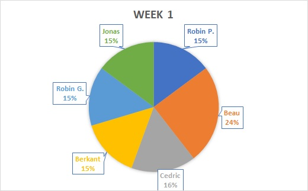

# Weekrapport 1

Datum contactmoment: 2019-09-23

## Overzicht gerealiseerde taken

- Uitleg en kick-off p3ops
- Verdeling groepen
- Repositories aanmaken
- Details opdracht per server lezen
- Persoonlijke github in orde maken

## Charts

### Trello

Afwezig omwille van organisatieverandering

### Burndown

Afwezig omwille van organisatieverandering

### Estimate/Spent

## Uittreksel timesheet

- Totaal gepresteerde uren afgelopen week: `TODO`
- Detailoverzicht gepresteerde uren per taak: 
  - (Cedric) Uitleg en kick-off p3ops: 2u
  - (Cedric) Verdeling groepen: 30min
  - (Cedric) Repositories aanmaken: 15min
  - (Cedric) Details opdracht per server lezen: 30min
  - (Jonas, Robin, Berkant) In deze eerste week was het kick-off (23/09) waar we de uitleg gekregen hebben en nog een kwartier gepraat hebben met groepsleden. Aangezien nog veel administratieve zaken moesten gebeuren in deze week is er concreet nog nergens aan begonnen geweest. We hebben enkel de opdracht doorgenomen zodat we wisten wat er de week erna (vanaf 30/09) allemaal juist ging moeten gebeuren. (elk 3 uur)

  - (Beau) Uitleg en kick-off p3ops: 2u
  - (Beau) Persoonlijke Github in orde zetten: 30 min
  - (Beau) Details opdracht per server lezen: 2u30 

  - (Robin P) Uitleg en kick-off p3ops: 2u
  - (Robin P) Verdeling groepen: 30min
  - (Robin P) Details opdracht per server lezen: 30min
 
## Planning volgende week

- Samenzitten met groep Gent om taken te verdelen
- Voorbereidend opzoekingswerk doen voor individuele opdracht

## Vragen voor de begeleiders

## Feedback van de begeleiders

