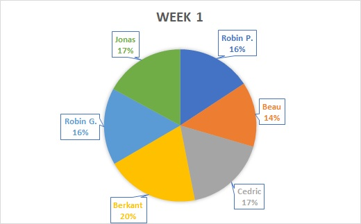

# Weekrapport 2

Datum contactmoment: 2019-09-30

## Overzicht gerealiseerde taken

- Videoconferentie met groep Gent gehouden i.v.m taakverdeling
- Weekrapport W1 aangevuld
- Weekrapport W2 aangevuld
- Ansible opzoekingswerk
  - [Presentatie M. DeHaan](https://www.youtube.com/watch?v=Qi0AhK7PMCI)
  - [Ansible Overview Screencast](https://www.youtube.com/watch?v=MfoAb50Br94)
  - [Ansible Configuration Templating](https://www.youtube.com/watch?v=p0C90zIbe5s)
- Afbeelding Trello-bord toevoegen aan weekrapport W2
- Afbeelding E/S toegevoegd aan weekrapport W1 en W2
- Uitproberen best practices Ansible
- Opzoeken Ansible rollen voor Delta1

## Charts

### Trello

Afwezig omwille van organisatieverandering

### Burndown

Afwezig omwille van organisatieverandering

### Estimate/Spent

## Uittreksel timesheet

- Totaal gepresteerde uren afgelopen week: `TODO`
- Detailoverzicht gepresteerde uren per taak: 
  - (Cedric) Videoconferentie met groep Gent gehouden i.v.m taakverdeling: 1u
  - (Cedric) Weekrapport W1 aangevuld: 15min
  - (Cedric) Weekrapport W2 aangevuld: 30min
  - (Cedric) Ansible opzoekingswerk: 2u 10min
  - (Cedric) Opzoeken Ansible rollen: 30min

  - (Beau) Regelen taakverdeling: 1u30min
  - (Beau) Ansible opzoekingswerk: 1u30min
  - (Beau) Github/Weekrapport: 30min

  - (Robin P) Videoconferentie met Gent: 15min
  - (Robin P) Aanmaken persoonlijk Trello-bord: 15min
  - (Robin P) Opzoekwerk dnsmasq: 1u
  - (Robin P) Opzoekwerk Ansible: 1u30
  
  - (Jonas, Robin, Berkant) Opzoekwerk omtrent Samba: elk 2u30 min (in les)
  - (Jonas, Robin, Berkant) Video bekijken van Bert Van Vreckem omtrent het opzetten Samba file server: elk 1u30 min (in les)
  - (Jonas, Robin, Berkant) Starten met de ansible omgeving te clonen en nader te bekijken, ansible rollen bekijken (Jonas: 20 min, Robin: 10 min, Berkant: 1 uur)
  - (Jonas, Robin, Berkant) We hebben deze week elk een persoonlijk logboek aangemaakt (moest van meneer Van Vreckem), dat nu blijkbaar toch niet moet? We hebben hieraan elk toch iets meer als een uur aan gespendeerd die uiteindelijk weggegooid werk waren. (elk 1 uur)

## Planning volgende week

- Server Delta1 opzetten en configureren
- Server Lima1 opzetten en configureren

## Vragen voor de begeleiders

## Feedback van de begeleiders

