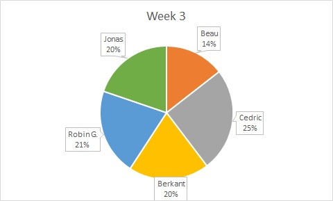
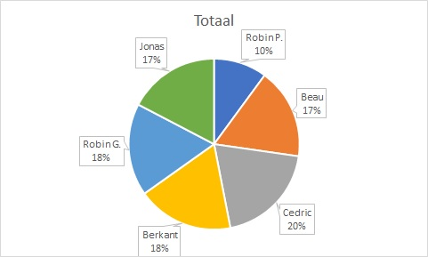

# Weekrapport 3

Datum contactmoment: 2019-10-07

## Overzicht gerealiseerde taken

- Verdelen groep in 2-2-2
  - Groep A1: Lima1
- Opzoeken informatie fileserver met SMB delta1
- Afdelingen + shares, users en permissies, home directory en firewall access
- Test runs en fouten oplossen (syntax...)
- Trello bord invullen + aanmaken repositories + weekrapporten en links toevoegen in github bestanden 
  - Groep A2: Delta1 opzetten, Delta1 "verzenden"
  - Groep A3: Opzoekingswerk Quebec1 (opzetten, niet configureren), Delta1 "Ontvangen"
- Opzoeken basis Delta1
- Opzetten basis Delta1
- Migreren weekrapporten naar Github Repo van Green

## Charts

### Trello

Afwezig omwille van organisatieverandering

### Burndown

Afwezig omwille van organisatieverandering

### Estimate/Spent

### Totaal spent

## Uittreksel timesheet

- Totaal gepresteerde uren afgelopen week: +/- 24u
- Detailoverzicht gepresteerde uren per taak: 
  - (Cedric) Opzoeken basis Delta1: 1u
  - (Cedric) Opzetten basis Delta1: 3u
  - (Cedric) Migreren weekrapporten naar Github Repo van Green: 2u

  - (Beau) opzoeken basis Delta1: 1u30min
  - (Beau) Opzoekingswerk Ansbile: 1u30min

  - (Robin P) Geen uren gepresteerd doordat laptop binnen was bij Lab9 voor reparatie
  
  - (Berkant en Jonas) Opzoeken informatie fileserver met SMB delta1: 1u
  - (Berkant en Jonas) afdelingen + shares, users en permissies, home directory en firewall access: 2u
  - (Berkant) Test runs en fouten oplossen (syntax...): 1u40
  - (Jonas) Trello bord invullen + aanmaken repositories + weekrapporten en links toevoegen in github bestanden: 1u45

## Planning volgende week

 - (Berkant en Jonas) Lima1 verder werken
 - (Berkant en Jonas) Communicatie met alpha1

## Vragen voor de begeleiders

## Feedback van de begeleiders

